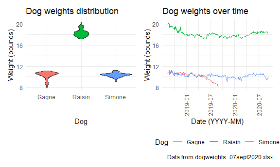

Midterm Project
================
Lily Wang
10/15/2020

``` r
library(tidyverse)
```

    ## -- Attaching packages --------------------------------------- tidyverse 1.3.0 --

    ## v ggplot2 3.3.2     v purrr   0.3.4
    ## v tibble  3.0.3     v dplyr   1.0.2
    ## v tidyr   1.1.2     v stringr 1.4.0
    ## v readr   1.3.1     v forcats 0.5.0

    ## -- Conflicts ------------------------------------------ tidyverse_conflicts() --
    ## x dplyr::filter() masks stats::filter()
    ## x dplyr::lag()    masks stats::lag()

``` r
library(readxl)
library(janitor)
```

    ## 
    ## Attaching package: 'janitor'

    ## The following objects are masked from 'package:stats':
    ## 
    ##     chisq.test, fisher.test

``` r
library(patchwork)

knitr::opts_chunk$set(
  fig.width = 6,
  fig.asp = .6,
  out.width = "90%"
)

theme_set(theme_minimal() + theme(legend.position = "bottom"))
```

The `dogweights` dataset contains the weights of three dogs, Simone,
Gagne, and Raisin in pounds, along with some occasional notes, from 2018
to 2020. The dogs are weighed every few days and a standard weight is
weighed occasionally as well to ensure accuracy.

``` r
dogweights_df <- 
  read_excel("./data/dogweights_07sept2020.xlsx",
    range = "B2:G207") %>% 
  clean_names() %>% 
  rename(notes = x6) %>% 
  filter(date != "s") %>% 
  mutate(
    date = as.numeric(date),
    date = excel_numeric_to_date(date, date_system = "modern"))
```

    ## New names:
    ## * `` -> ...6

``` r
notes_df <- 
  select(dogweights_df, c(date, notes)) %>% 
  drop_na()

dogweights_df <-
  select(dogweights_df, !notes) %>% 
  pivot_longer(raisin:std,
               names_to = "name",
               values_to = "weight") %>% 
  relocate(date, name, weight) %>% 
  drop_na() %>% 
  separate(weight, c("lbs","oz"), " ") %>% 
  mutate(lbs = as.numeric(lbs),
         oz = as.numeric(oz),
         oz = oz/16,
         weight = lbs + oz) %>% 
  select(date, name, weight)
```

    ## Warning: Expected 2 pieces. Missing pieces filled with `NA` in 2 rows [138,
    ## 365].

``` r
write_csv(dogweights_df, "./data/weights_cleaned.csv")
write_csv(notes_df, "./data/notes_cleaned.csv")

view(dogweights_df)
```

The cleaned `dogweights` dataset is 552 rows and 3 columns and does not
contain notes. One entry between 1/19/19 and 1/26/19 had an invalid date
so it was dropped. The weights in the original dataset were entered as
pounds and ounces separated by a space, which were converted into pounds
with decimals instead, for ease of visualization later. Cells that had
no weight entry were dropped.

The notes from the original dataset were transferred to a separate
`notes` dataset that contains just the notes and the dates they were
taken on.

``` r
distr_plot <- 
  dogweights_df %>% 
  filter(name != "std") %>% 
  ggplot(aes(x = name, y = weight)) +
  geom_boxplot() +
  labs(
    title = "Weight distribution",
    x = "Dog",
    y = "Weight (pounds)"
  )

time_plot <-
  dogweights_df %>% 
  filter(name != "std") %>% 
  ggplot(aes(x = date, y = weight, color = name)) +
  geom_line() +   
  labs(
    title = "Weight over time",
    x = "Date",
    y = "Weight (pounds)",
    caption = "Data from dogweights_07sept2020.xlsx"
  )

distr_plot + time_plot
```

    ## Warning: Removed 2 rows containing non-finite values (stat_boxplot).


